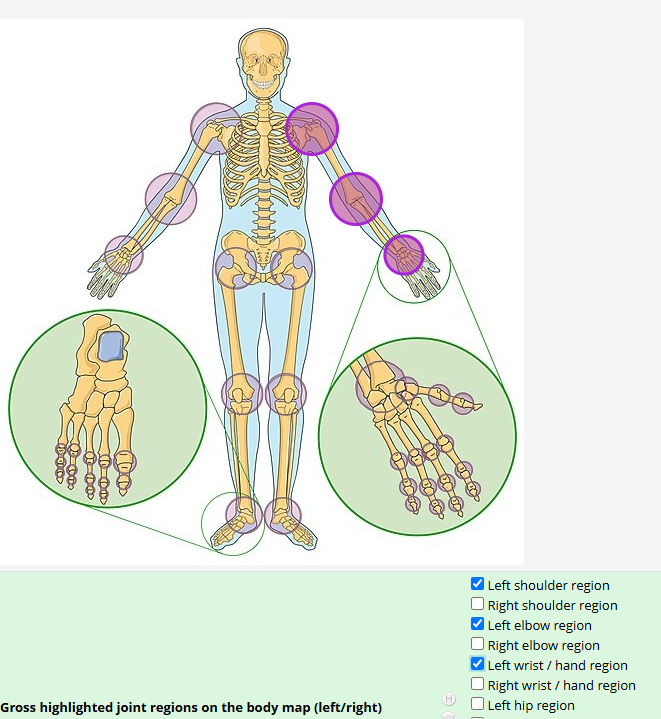
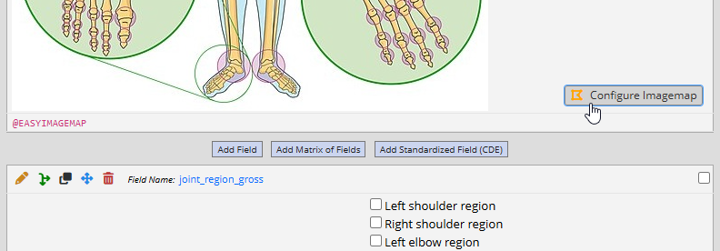
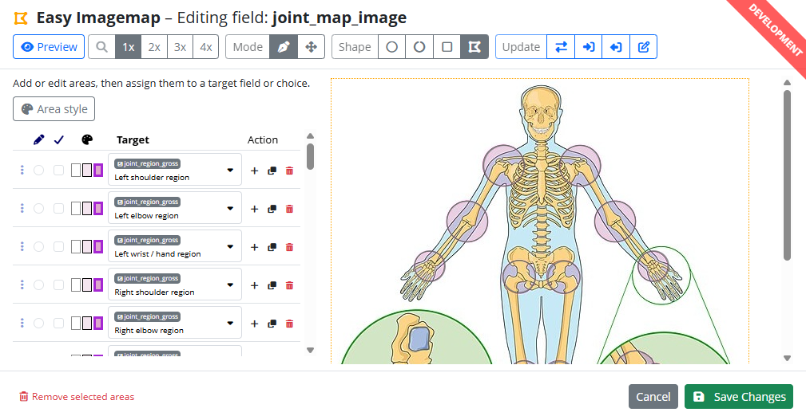
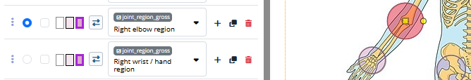
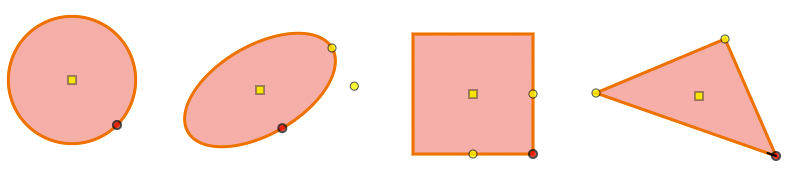
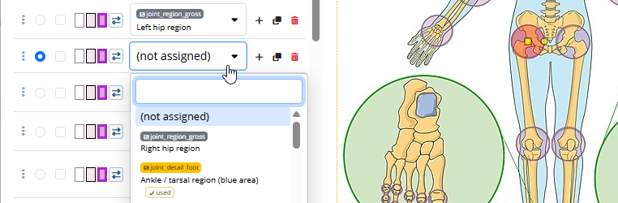
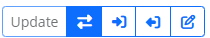
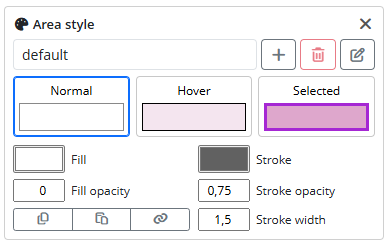
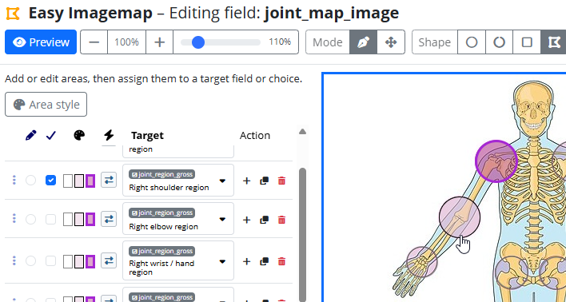
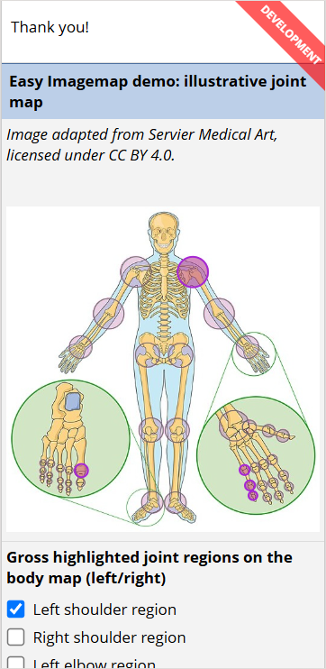

# Easy Imagemap

[](https://doi.org/10.5281/zenodo.20555865)

Easy Imagemap is a REDCap External Module for turning an inline image in a descriptive field into a clickable image map. It is useful when a choice field is easier, safer, or faster to complete by touching a region on an image than by scanning a long list of choices. Typical examples are body maps, joint counts, wound diagrams, dental charts, specimen diagrams, or other structured clinical/registry forms where the visual location matters.

The module is intentionally REDCap-native. The source image must be attached to a descriptive field and displayed inline in the data dictionary. The clickable areas are stored in the `@EASYIMAGEMAP` action tag parameter on that same descriptive field, so the configuration remains part of project metadata and can be reviewed, exported, drafted, and migrated like other instrument design changes.

On data entry forms and surveys, the module renders a responsive SVG overlay on top of REDCap's inline image. Each SVG area is linked to a REDCap field or choice. Clicking or tapping the area can update the REDCap input, and in two-way mode changes to the REDCap input can also update the selected state of the image area.



Note: The example joint-selection map is using a skeleton illustration adapted from _Servier Medical Art_, licensed under CC BY 4.0. Clickable regions and highlighting are Easy Imagemap SVG overlays and are not part of the source image. The example image and demo fields are for demonstrating field interaction only. They are not intended to define a clinical scoring instrument.

## Why not a classic HTML image map?

Easy Imagemap does not require custom HTML, external image hosting, or manually maintained coordinate lists. The image is a normal REDCap inline image, the map configuration is stored in the descriptive field’s action tag, and the overlay is generated responsively at runtime. This keeps the configuration reviewable, exportable, and compatible with normal REDCap project design workflows.

## Scope

Easy Imagemap supports descriptive fields with inline images only. External image URLs, File Repository files, and arbitrary HTML image sources are not supported.

Clickable areas can target these REDCap field types on the same instrument or survey page:

- `checkbox`
- `radio`
- `select`, including autocomplete dropdowns
- `yesno`
- `truefalse`

The designer supports four area shapes:

- Polygon
- Rectangle
- Circle
- Ellipse

## Setup

Enable the External Module for the project, then open Online Designer. Users need REDCap Design rights to configure maps.

Create or choose a **descriptive field with an image displayed inline**. In the field annotation / action tag area, add:

```text
@EASYIMAGEMAP
```

After the action tag is added, Online Designer shows a **Configure Imagemap** button on that descriptive field.



Click **Configure Imagemap** to open the visual designer. The first save writes canonical JSON into the action tag parameter:

```text
@EASYIMAGEMAP={
    "version": 1,
    "bounds": { "width": 500, "height": 467 },
    "styles": { "default": {} },
    "shapes": []
}
```

The module can read empty parameters, the current `version: 1` format, and older demo-style data that used numbered entries with `points`, `_w`, `_h`, and `field::code` targets. Legacy data is normalized in memory when displayed or edited. It is only rewritten when the map is saved from the designer.

For production projects, REDCap draft mode must be open before saving Easy Imagemap changes. If the project is in production without draft mode, the designer will refuse to save.

## Designer Overview

The designer has three main parts: the toolbar, the image canvas, and the assignment table. The optional style panel can be opened when you need to adjust colors and borders.



The toolbar controls:

- **Preview**: temporarily test area selection inside the designer.
- **Zoom**: scale the image from 50% to 400%.
- **Mode**: switch between editing one shape and moving one or more selected shapes together.
- **Shape**: choose polygon, rectangle, circle, or ellipse for the active area.
- **Update**: choose how the active area is bound to REDCap data.

Edit mode is for precise handle-level changes to the active area. Move mode is for layout work: select one or more areas, then drag any selected shape to move the whole selection together.

The assignment table contains one row per clickable area. A row stores the area's shape, selected style, target field or choice, and update mode. Use the action buttons to add a row, duplicate a row, or remove a row.



## Creating Areas

Start by adding an area row in the assignment table. Select the row for editing, choose a shape type, then define the shape on the image.

For polygons, click on the image to add vertices. Drag a vertex handle to reposition it. Drag the square center handle to move the whole polygon. The active polygon vertex is marked with a short direction tick; new vertices are inserted relative to that active vertex. Use `Tab` to move through handles, and `Backspace` to remove the active polygon vertex.

For circles, click and drag from the center to set the radius. Later, drag the square center handle to move the circle or drag the perimeter handle to resize it. Hold `Ctrl` while dragging the perimeter handle to show radial guide lines and snap the handle to 45-degree directions from the center.

For rectangles, click and drag to place the shape. Drag the square center handle to move it, the side handles to resize or rotate along each axis, or the corner handle to resize and rotate while preserving the aspect ratio. Hold `Ctrl` while dragging a non-center handle to show radial guide lines and snap the dragged handle to 45-degree directions from the center. Hold `Shift` while dragging an axis handle to constrain width and height together.

For ellipses, click and drag to place the shape. Drag the square center handle to move it, the x/y radius handles to resize or rotate the axes, or the corner handle to resize and rotate while preserving the aspect ratio. Hold `Ctrl` while dragging a non-center handle to show radial guide lines and snap the dragged handle to 45-degree directions from the center. Hold `Shift` while dragging an axis handle to keep the radii in sync.



Changing the shape type of an existing area converts the geometry instead of deleting it. Rectangles convert to inscribed circles or ellipses, circles and ellipses convert to enclosing rectangles, and polygons convert to or from an outer bounding shape. The designer asks for confirmation before converting and can remember the choice in the browser.

Useful editing shortcuts:

- `Ctrl`-click an area in edit mode to add it to the current selection. In move mode, `Ctrl`-click an unselected area to add it to the selection.
- Use the zoom slider or mouse wheel over the image canvas to zoom in 5% steps. Use the zoom buttons for adaptive 25% or 50% steps, or to reset to 100%.
- Hold `Space` and drag the image canvas to pan the zoomed view.
- Drag the square center handle in edit mode to move the active shape.
- Hold `Ctrl` while dragging a center handle in edit mode to show radial guide lines and constrain movement to 45-degree directions from the drag start.
- Hold `Alt` while dragging the square center handle in edit mode to duplicate the active shape and drag the copy.
- In move mode, drag a selected shape to move all selected shapes simultaneously.
- Hold `Alt` while dragging in move mode to create moved copies of the selected shapes.
- Hold `Ctrl` while moving shapes in move mode to show movement axes and constrain movement to 45-degree steps.
- Use arrow keys to move the active handle in edit mode or all selected shapes in move mode.
- Hold `Shift` with arrow keys to move by 10 pixels instead of 1 pixel.
- Press `Delete` in edit mode to clear the active area's shape.
- Press `Esc` in edit mode to leave the active area.
- Press `m` in edit mode to switch to move mode, or `e` in move mode to switch back to edit mode.

Keyboard shortcuts are ignored while focus is inside inputs, dropdowns, buttons, or other editable controls, so they do not interfere with assigning targets or editing style values.

## Assigning Areas To REDCap Fields

Each area can be assigned to a target in the assignment table. The target dropdown lists supported fields on the same instrument. For fields with choices, the dropdown lists each choice separately.

Checkbox targets are assigned to individual checkbox choices. For example, an area over the left wrist might target `joint_swollen:left_wrist`. Clicking the area toggles that checkbox choice.

Radio, yes/no, true/false, and select targets are assigned to one choice at a time. The dropdown also includes an empty/reset option for radio-like fields. This can be useful when an image region should clear a field rather than choose one of its coded values.

Select targets update the underlying select field and, when REDCap displays an autocomplete text input, the visible autocomplete value as well.



## Update Modes

Each area has an update mode. The toolbar buttons apply a mode to the active area or to selected rows.

Use **two-way** mode when the image and REDCap input should stay synchronized. Clicking the image updates the field, and changing the field updates the selected state on the image. This is the best default for most data entry tasks, such as tender/swollen joint maps linked to checkbox choices.

Use **to-target** mode when the image should write to REDCap, but the area does not need to react to later field changes. This can be useful for quick-pick images where the visual state is less important than using the image as a large touch-friendly input.

Use **from-target** mode when the image should be a visual display of data, not an input. In this mode clicking the area does not change the REDCap field. This can be useful for review forms, survey confirmation pages, or diagrams where the selected regions should reflect existing values while preventing edits from the image itself.



## Styles

The style panel manages named styles. Every map starts with a `default` style, and each area stores only the name of the style it uses. This keeps the action tag JSON smaller and makes consistent styling easier.

Open the style panel when you want to change colors, opacity, or stroke width. A style has three states:

- **Normal**: the area when it is not hovered or selected.
- **Hover**: the area while the pointer is over it.
- **Selected**: the area when its REDCap target is selected or when the row is checked in designer preview mode.

For each state, you can edit fill color, stroke color, fill opacity, stroke opacity, and stroke width. The style panel also lets you copy one state, paste it into another, or synchronize the active state across all three states.



To add a style, click the add button next to the style selector, enter a name, and confirm. To delete a style, select it and use the delete button. If the style is assigned to any areas, the designer asks which remaining style should replace it.

The assignment table shows a compact three-state preview for each row so you can quickly see which style is assigned.

## Previewing And Saving

Use **Preview** to test selections inside the designer without leaving Online Designer. Clicking an area in preview mode toggles the row's selected checkbox and applies the selected style. Press `Esc` to leave preview mode.



Click **Save Changes** when the map is ready. If nothing changed, the module does not update project metadata and does not add a project log entry. If another user changed the same Easy Imagemap configuration after you opened the designer, the save dialog asks whether to overwrite the newer version.

Saving updates the descriptive field's action tag parameter directly in REDCap metadata and logs the change in the project log with action `Design`.

## Data Entry And Surveys

On data entry forms and surveys, Easy Imagemap waits for REDCap to render the page, finds the inline image by REDCap's document hash, and overlays an SVG with the saved shapes. The overlay follows REDCap image resizing and fitting, so it works with responsive survey layouts and mobile/touch use.

Clicking or tapping an area updates the configured REDCap field unless the area is in `from-target` mode or the target input is disabled or locked. Disabled and locked REDCap fields remain protected.

In multi-page surveys, a map is initialized only when both the descriptive image field and its target fields are on the current survey page. This avoids creating clickable areas for fields that are not present on the page.



## Compatibility And Deployment

The public action tag is stable:

```text
@EASYIMAGEMAP
```

Current designer saves use this canonical structure:

```json
{
    "version": 1,
    "bounds": { "width": 500, "height": 467 },
    "styles": {
        "default": {}
    },
    "shapes": []
}
```

The module preserves compatibility with older supported parameter formats when viewing data entry forms, surveys, or opening the designer. It does not automatically migrate old parameters in the background. A legacy parameter becomes canonical only when a user saves from the designer.

For production projects, deploy module code and project metadata updates together if you plan to save existing maps with the revised designer. REDCap draft mode must be open before saving changes in production projects.

Invalid JSON in the action tag remains a hard error and must be fixed manually. Invalid individual areas are skipped during display when possible, and save-time validation prevents incomplete or invalid designer areas from being silently persisted.

## License And Third-Party Material

The Easy Imagemap module source code is licensed under the MIT License. This license does not relicense third-party material shown or referenced in the documentation, including REDCap user interface elements, REDCap names and trademarks, cited or demo artwork such as the Servier Medical Art-derived example image, or project-specific source images visible in screenshots. Those materials remain subject to their respective licenses, terms, and rights holders.

## How to cite this work

If you use this external module for a project that generates a research output, please cite this software in addition to [citing REDCap](https://projectredcap.org/resources/citations/). You can do so using the APA referencing style as below:

> Rezniczek, G. A. (2026). Easy Imagemap (REDCap External Module) [Computer software]. https://doi.org/10.5281/zenodo.20555865

Or by adding this reference to your BibTeX database:

```bibtex
@software{Rezniczek_Easy_Imagemap_REDCap_EM_2026,
author = {Rezniczek, Günther A.},
doi = {10.5281/zenodo.20555865},
title = {{Easy Imagemap (REDCap External Module)}},
url = {https://github.com/grezniczek/redcap_imagemap},
version = {1.0.0},
year = {2026}
}
```

These instructions are also available in [GitHub](https://github.com/grezniczek/redcap_imagemap) under 'Cite This Repository'.

## Support this work

If you find this software useful, you can [buy me a coffee or a beer](https://www.paypal.com/donate/?hosted_button_id=6VRC2JFRCBGRN). Your support is purely voluntary and helps me continue improving this project. Of course, you are not entitled to any special benefits—except my silent appreciation while enjoying the drink! 🍻☕

You can use the link or the QR code below to make a donation via PayPal.


_Please note that donations are purely voluntary and not tax-deductible._


---

**Disclaimer**

Parts of this documentation and release polish were developed with assistance from OpenAI's ChatGPT/Codex to support clarity, consistency, and ease of use for REDCap project designers. Final content has been reviewed and adapted by the maintainer to reflect the specific functionality and standards of the *Easy Imagemap* external module.
